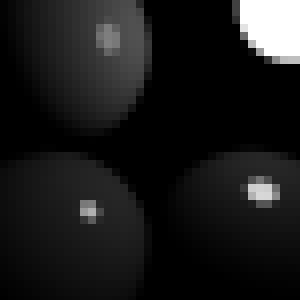
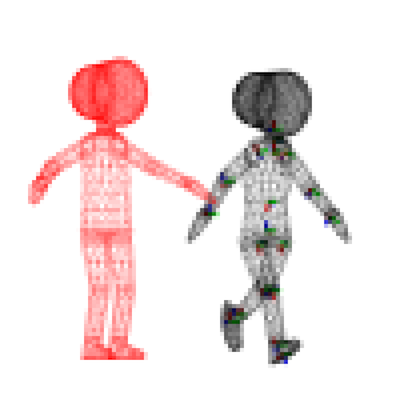

# Applied Computer Graphics 4860-1084

Lecture at graduate school of information science and technology in the university of Tokyo, spring semester, 2024

ITC-LMS (for Slack and GitHub Classroom invitations): 

- https://itc-lms.ecc.u-tokyo.ac.jp/lms/course?idnumber=20244860-10840F01

## Instructor

Dr. Nobuyuki Umetani 
- email: n.umetani@gmail.com
- url: http://www.nobuyuki-umetani.com/
- lab's web page: https://cgenglab.github.io/labpage/en/

## Time

Monday 2rd period, 10:25am - 12:10pm

## Course Description

Computer graphics is a technology to computationally represent objects' geometry, appearance and movement. This course is an introduction to the techniques generally seen in computer graphics. The aim of the course is to get familiar with applied mathematics such as linear algebra, vector analysis, partial differential equations, numerical analysis and optimization through the topics in computer graphics. There are C++ programming assignments to acquire research-oriented graphics programming skills such as OpenGL, shader programming, Eigen matrix library, Git and cmake. 

Topics:
- affine transformation & homography
- character animation (forward & inverse kinematics)
- visualization (rasterization / ray casting)
- optimization ( continuous optimization / dynamic programming )
- parametric curves & surfaces
- variational mesh deformation
- grid-based fluid simulation

## Lecture Schedule

| Day | Topic | Assignment | Slide |
|:----|:---|:---|:---|
|(1) Apr. 11| **Introduction** graphics pipeline |  | [[3]](http://nobuyuki-umetani.com/acg2022s/graphics_pipeline.pdf) |
|(2) Apr. 18| **Coordinate transfrormation** barycentric transformation | [task00](task00) | [[4] ](http://nobuyuki-umetani.com/acg2022s/barycentric_coordinate.pdf), [[5]](http://nobuyuki-umetani.com/acg2022s/transformation.pdf) |
|(3) Apr. 25| **Coordinate transformation2** | [task01](task01) | - |
|(5) May 2| **Rasterization** | [task02](task02) |  [[6]](http://nobuyuki-umetani.com/acg2022s/rasterization.pdf) |
|(4) May 9| **Ray Casting I** | [task03](task03) | [[7]](http://nobuyuki-umetani.com/acg2022s/implicit_modeling.pdf) |
|(6) May 16| **Ray Casting II** | [task04](task04) | [[8]](http://nobuyuki-umetani.com/acg2022s/raycasting.pdf) |
|(7) May 23| Parametric curves / surfaces | [task05](task05) | [[9]](http://nobuyuki-umetani.com/acg2022s/curve.pdf)|
|(8) June 6|  Character deformation | [task06](task06) | [[10]](http://nobuyuki-umetani.com/acg2022s/character_deformation.pdf), [[11]](http://nobuyuki-umetani.com/acg2022s/jacobian.pdf) |
|(9) June 13| Optimization | [task07](task07) | [[12]](http://nobuyuki-umetani.com/acg2022s/optimization.pdf) |
|(10) June 20| Laplacian mesh deformation | [task08](task08) | [[13]](http://nobuyuki-umetani.com/acg2022s/mesh_laplacian.pdf) |
|(11) June 27| Guest lecture by Dr. Ryoichi Ando | - | - |
|(12) July 4| Grid-based Fluid Ⅰ | [task09](task09) | [[14]](http://nobuyuki-umetani.com/acg2022s/pde.pdf) |
|(13) July 11| Grid-based Fluid Ⅱ | - | [[15]](http://nobuyuki-umetani.com/acg2022s/fluid_simulation.pdf)  |

## Grading

- 20% lecture attendance
  - Attendance is counted based on writing a secret keyword on LMS. The keyword is announced for each lecture.  
- 80% small assignments
  - see below

## Assignemnts

There are many small programming assignments. 
To do the assignments, you need to create your own copy of this repository through **GitHub Classroom**.  
These assignments need to be submitted using **pull request** functionality of the GitHub. 
Look at the following document. 

[How to Submit the Assignments](doc/submit.md)

| Task ID | Title | Thumbnail |
|:---|:---|:---|
| [task00](task00)| build C++ Program with CMake |  |
| [task01](task01)| 2D Homography Transformation |  |
| [task02](task02)| GLSL Vertex Shader (Fisheye Lens) |  |
| [task03](task03)| GLSL Fragment Shader (Sphere Tracing / SDF) |  |
| [task04](task04)| Importance Sampling (Ambient Occlusion) |   |
| [task05](task05)| Rasterization of Cubic Bézier Curves (Sturm's Method) ||
| [task06](task06)| Linear Blend Skinning (Articulated Rigid Body, Inverse Binding Matrix) ||
| [task07](task07)| Inverse Kinematics (Levenberg–Marquardt method) |  |
| [task08](task08)| Laplacian Mesh Deformation (Quadratic Programming, Sparse Matrix) |  |
| [task09](task09)| Poisson Image Editing((Gauss-Seidel method, pybind11)) |  |

### Policy

- Do the assignment by yourself. Do not share the answers of the assignments.
- Late submission of an assignment is subject to grade deduction.
- Score each assignment will not be open soon (instructor needs to adjust weight of the score later).
- The grading of the assignments might not be soon.

## Slides

- [[1] C++ programming](http://nobuyuki-umetani.com/acg2022s/cpp.pdf)
- [[2] Git+GitHub](http://nobuyuki-umetani.com/acg2022s/git.pdf)
- [[3] Graphics pipeline](http://nobuyuki-umetani.com/acg2022s/graphics_pipeline.pdf)
- [[4] Barycentric coordinate](http://nobuyuki-umetani.com/acg2022s/barycentric_coordinate.pdf)
- [[5] Coordinate transformation](http://nobuyuki-umetani.com/acg2022s/transformation.pdf)
- [[6] Rasterization](http://nobuyuki-umetani.com/acg2022s/rasterization.pdf)
- [[7] Implicit Modeling](http://nobuyuki-umetani.com/acg2022s/implicit_modeling.pdf)
- [[8] Ray Casting](http://nobuyuki-umetani.com/acg2022s/raycasting.pdf)
- [[9] Parametric Curve](http://nobuyuki-umetani.com/acg2022s/curve.pdf)
- [[10] Character Deformation](http://nobuyuki-umetani.com/acg2022s/character_deformation.pdf)
- [[11] Jacobian & Hessian](http://nobuyuki-umetani.com/acg2022s/jacobian.pdf)
- [[12] Optimization](http://nobuyuki-umetani.com/acg2022s/optimization.pdf) 
- [[13] Mesh Laplacian](http://nobuyuki-umetani.com/acg2022s/mesh_laplacian.pdf)
- [[14] PDE](http://nobuyuki-umetani.com/acg2022s/pde.pdf) 
- [[15] Grid-based Fluid](http://nobuyuki-umetani.com/acg2022s/fluid_simulation.pdf) 

## Reading Material
- [Introduction to Computer Graphics by Cem Yuksel](https://www.youtube.com/watch?v=vLSphLtKQ0o&list=PLplnkTzzqsZTfYh4UbhLGpI5kGd5oW_Hh)
- [Scratchpixel 2.0](https://www.scratchapixel.com/)
- [Awesome Computer Graphics (GitHub)](https://github.com/luisnts/awesome-computer-graphics)
- [Skinning: Real-time Shape Deformation SIGGRAPH 2014 Course](https://skinning.org/)
- [Physics-based Animation2022S (Another course by the instructor) ](https://github.com/nobuyuki83/Physics-based_Animation_2021S)

