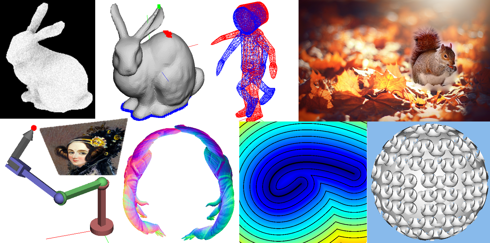
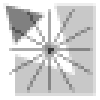
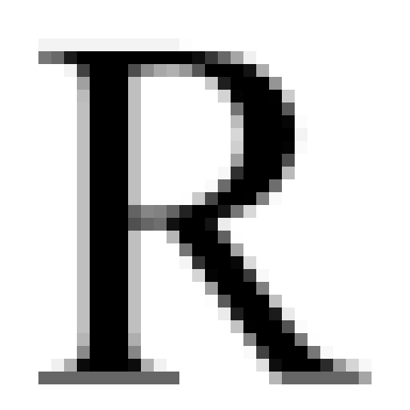
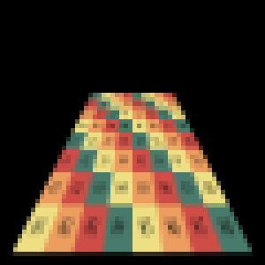
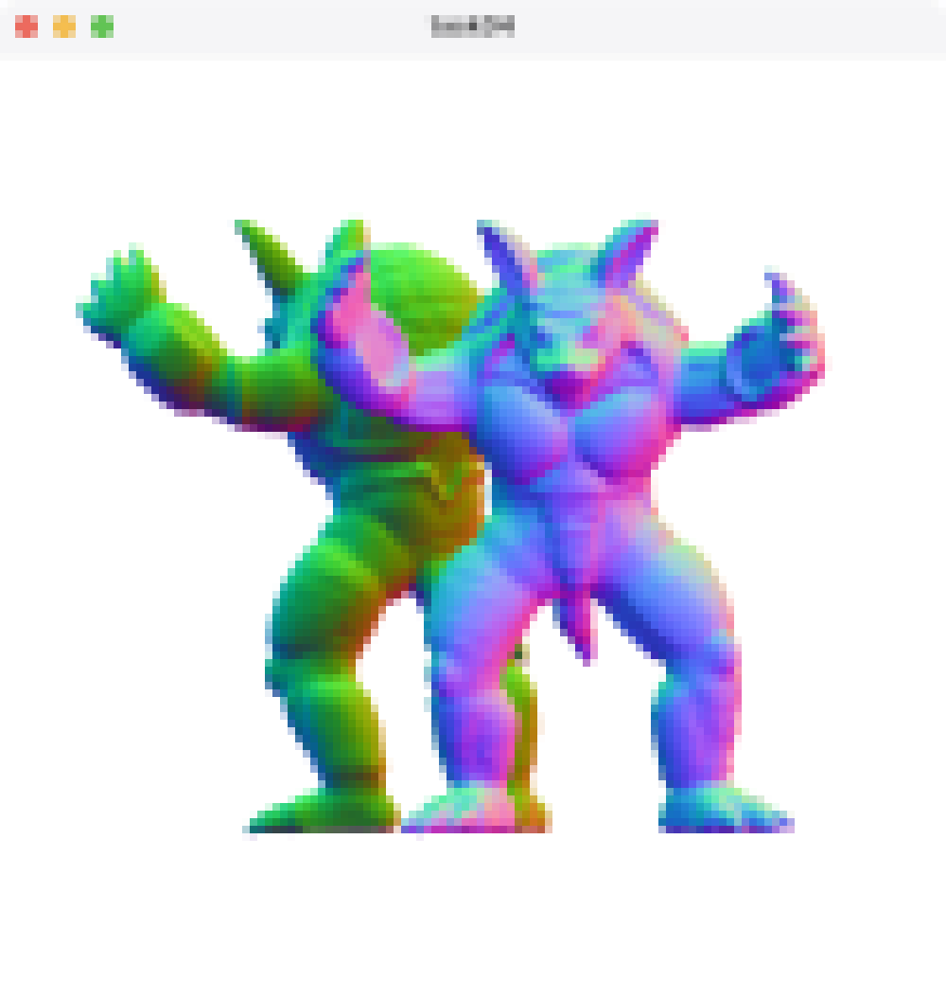
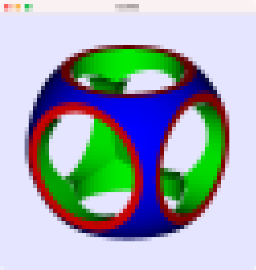

# Applied Computer Graphics 4860-1084

Lecture at graduate school of information science and technology in the university of Tokyo, spring semester, 2024

UTOL (UTokyo-LMS) (for Zoom URL, Slack and GitHub Classroom invitations): 

- https://utol.ecc.u-tokyo.ac.jp/lms/course?idnumber=2024_4886_4860-1084_01

## Instructors

Dr. Nobuyuki Umetani 
- email: n.umetani@gmail.com
- url: http://www.nobuyuki-umetani.com/
- lab's web page: https://cgenglab.github.io/labpage/en/

TA: Kenji Tojo
- url: https://kenji-tojo.github.io/

## Time

Monday 2rd period, 10:25am - 12:10pm

## Course Description

Computer graphics is a technology to computationally represent objects' geometry, appearance and movement. This course is an introduction to the techniques generally seen in computer graphics. The aim of the course is to get familiar with applied mathematics such as linear algebra, vector analysis, partial differential equations, numerical analysis and optimization through the topics in computer graphics. There are C++ programming assignments to acquire research-oriented graphics programming skills such as OpenGL, shader programming, Eigen matrix library, Git and cmake. 

Topics:
- affine transformation & homography
- character animation (forward & inverse kinematics)
- visualization (rasterization / ray casting)
- optimization ( continuous optimization / dynamic programming )
- parametric curves & surfaces
- variational mesh deformation
- grid-based fluid simulation

## Lecture Schedule

| Day | Topic | Assignment | Slide |
|:----|:---|:---|:---|
|(1) Apr. 8| **Introduction** **Rasterization in 2D**, Digital Differential Analyzer |  | [[1]](http://nobuyuki-umetani.com/acg2024s/introduction.pdf), [[4]](http://nobuyuki-umetani.com/acg2024s/digital_image.pdf) |
|(2) Apr. 15| **Parametric curves / surfaces**  Bézier curve, polynominal | [task01](task01) | [[5]](http://nobuyuki-umetani.com/acg2024s/rasterization_2d.pdf) [[6]](http://nobuyuki-umetani.com/acg2024s/barycentric_coordinates.pdf) |
|(3) Apr. 22| **Coordinate transfrormation** Affine, homography transformation | task02 | |
|(5) May 7| **Graphics Pipeline 1** depth buffer method, shading | task03 | |
|(4) May 13| **Graphics Pipeline 2** shadow, anti aliasing | task04 | |
|(6) May 20| **Ray Casting 1** spatial data structure | task05 | |
|(7) May 27| **Ray Casting 2** Rendering equation, Monte Carlo integration | task06 | |
|(8) June 3| **Character animation**  Linear blend skinning | task07 | |
|(9) June 10| Guest lecture by Dr. Rex West |  | |
|(10) June 17| **Optimization**   Inverse kinematic | task08 | |
|(11) June 24| Laplacian mesh deformation | task09 | |
|(12) July 12| **Grid-based Fluid Ⅰ**  Poisson equation | task10 |  |
|(13) July 8| **Grid-based Fluid Ⅱ**  Stam fluid | | |

## Grading

- 20% lecture attendance
  - Attendance is counted based on writing a secret keyword on LMS. The keyword is announced for each lecture.  
- 80% small assignments
  - see below

## Assignemnts

There are many small programming assignments. 
To do the assignments, you need to create your own copy of this repository through **GitHub Classroom**.  
These assignments need to be submitted using **pull request** functionality of the GitHub. 
Look at the following document. 

[How to Submit the Assignments](doc/submit.md)

| Task ID | Title | Thumbnail |
|:---|:---|:---|
| [task01](task01) | **Rasterization of lines and polygons** DDA, winding number |  |
| task02 | **Rasterization of parametric curves**  Quadratic Bézier curve, root of polynominal |  |
| task03 | **Perspectively-correct texture mapping** rasterization of triangle, barycentric coordinate |  |
| task04 | **Vertex shader practice**  Rendering pipeline, mirror reflection, OpenGL |  |
| task05 | **Fragment shader practice** Ray marching method, CSG modeling, implicit modeling |  |
| task06 | TBD |  |
| task07 | TBD |  |
| task08 | TBD |  |
| task09 | TBD |  |
| task10 | TBD |  |

### Policy

- Do the assignment by yourself. Do not share the answers of the assignments.
- Late submission of an assignment is subject to grade deduction.
- Score each assignment will not be open soon (instructor needs to adjust weight of the score later).
- The assignments might not be graded soon.

## Slides

- [[1] Introduction](http://nobuyuki-umetani.com/acg2024s/introduction.pdf)
- [[2] C++ programming](http://nobuyuki-umetani.com/acg2024s/cpp.pdf)
- [[3] Git+GitHub](http://nobuyuki-umetani.com/acg2024s/git.pdf)
- [[4] Digital Image](http://nobuyuki-umetani.com/acg2024s/digital_image.pdf)
- [[5] Rasterization in 2D](http://nobuyuki-umetani.com/acg2024s/rasterization_2d.pdf)
- [[6] Barycentric Coordinates](http://nobuyuki-umetani.com/acg2024s/barycentric_coordinates.pdf)
- [[7] Parametric Curve](http://nobuyuki-umetani.com/acg2024s/parametric_curve.pdf)

## Reading Material
- Introduction to Computer Graphics by Cem Yuksel](https://www.youtube.com/watch?v=vLSphLtKQ0o&list=PLplnkTzzqsZTfYh4UbhLGpI5kGd5oW_Hh)
- [Scratchpixel 2.0](https://www.scratchapixel.com/)
- [Awesome Computer Graphics (GitHub)](https://github.com/luisnts/awesome-computer-graphics)
- [Skinning: Real-time Shape Deformation SIGGRAPH 2014 Course](https://skinning.org/)
- [Physics-based Animation2023S (Another course by the instructor) ](https://github.com/nobuyuki83/Physics-based_Animation_2023S)
- [Physics-based Animation2021S (Another course by the instructor) ](https://github.com/nobuyuki83/Physics-based_Animation_2021S)
- [Applied Computer Graphics 2022S (The same course two years ago)](https://github.com/nobuyuki83/Applied_Computer_Graphics_2022S)

