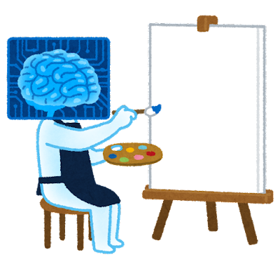

# Task01: Rasterization of lines and polygons

**Deadline: April 18st (Thu) at 15:00pm**


This is the blurred preview of the expected result:


When you execute the program, it will output an PNG image file (`output.png`) replacing the image below. Try making the image below and the image above look similar after doing the assignment.



## Problem1: Build and Execute the Program

Follow the instruction below to build and execute the attached code `main.ccp`.

### Set Up Programming Environment 

You need to have **git**, **cmake**, and **C++ compiler** in your computer to complete this assignment. Read the following document to install these. 

[How to Set Up C++ Programming Environment](../doc/setup_env.md)

### Go to Local Repository

if you don't have the local repository (repository on your computer), clone it from the remote repository (repository on the GitHub).

```bash
$ git clone https://github.com/ACG-2024S/acg-<username>.git
```

Go to the top of the local repository

```bash
$ cd acg-<username>     # go to the local repository
```


### Update Local Repository

Please updat the local repository on your computer

```bash
$ git checkout main   # set main branch as the current branch
$ git fetch origin main    # download the main branch from remote repository
$ git reset --hard origin/main  # reset the local main branch same as remote repository
```

### Create a Branch

To do this assignement, you need to be in the branch `task01`.  You can always check your the current branch by

```bash
$ git branch -a   # list all branches, showing the current branch 
```

You are probably in the `main` branch. Let's create the `task01` branch and set it as the current branch.

```bash
$ git branch task01   # create task0 branch
$ git checkout task01  # switch into the task01 branch
$ git branch -a   # make sure you are in the task01 branch
```


### Compile the Code 

After the environment is ready, let's build and compile the code. We do **out-of-source** build by making a new directory for build `task01/build` and compile inside that directory
```bash
$ cd task01
$ mkdir build
$ cd build
$ cmake .. 
$ cmake --build .
```

Now you will see the `output.png` is updated. The `output.png` will show a gray triangle around top-left corner. Now let's write a program to make more complicated images. 

## Problem2: Draw a Polygon

Edit the `main.ccp` around line #67 to implement the inside/outside test for a convex polygon using the winding number. 


## Problem3: Draw Lines

Edit `main.ccp` around line # 93 to implement line rasterization using DDA (digital differential analyzer).


### Submit

Finally, you submit the document by pushing to the `task01` branch of the remote repository. 

```bash
cd acg-<username>    # go to the top of the repository
git status  # check the changes (this will hilight main.cpp and output.png)
git add .   # stage the changes
git status  # check the staged changes
git commit -m "task01 finished"   # the comment can be anything
git push --set-upstream origin task01  # up date the task01 branch of the remote repository
```

got to the GitHub webpage `https://github.com/ACG-2024S/acg-<username>` . If everything looks good on this page, make a pull request. 


----


## Trouble Shooting

- I mistakenly submit the assignement in the `main` branch
  - Make a branch `task01` and submit again
- When I type `git status`, it shows many files. 
  - Do not commit intermediate files. Make sure you are correctly doing the **"out-of-source build"** If necessary edit the `.gitignore` file to remove the intermediate files.
- When something does wrong, consider doing from scratch (start from `git clone`).  


