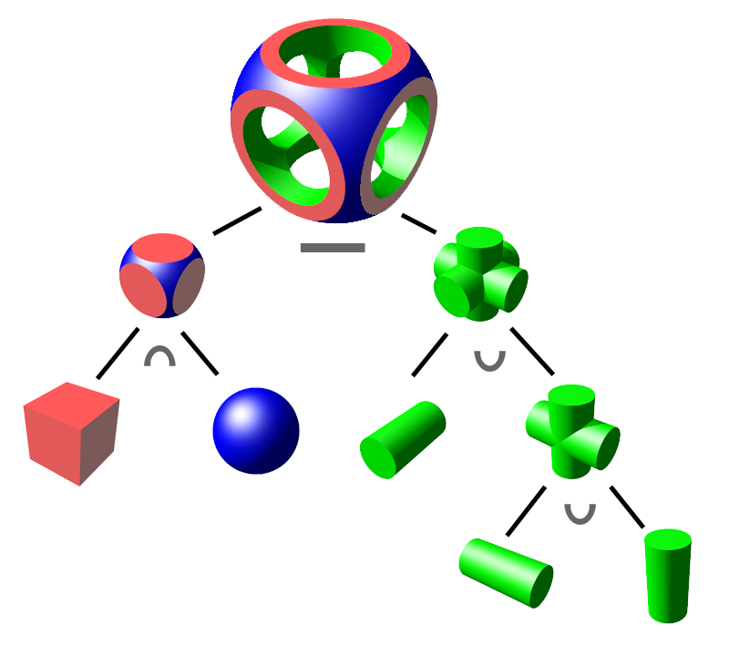

# Task05: Fragment Shader Practice (Implicit Modeling, Sphere Tracing)

**Deadline: May 23rd (Thu) at 15:00pm**

----

## Before Doing Assignment

If you have not done the [task01](../task01), [task02](../task02) do it first to set up the C++ development environment.

Follow [this document](../doc/submit.md) to submit the assignment, In a nutshell, before doing the assignment,  
- make sure you synchronized the `main ` branch of your local repository  to that of remote repository.
- make sure you created branch `task05` from `main` branch.
- make sure you are currently in the `task05` branch (use `git branch -a` command).

Additionally, you need to install `glfw` library. 
Follow [this document](../doc/setup_glfw.md) to install glfw.

Now you are ready to go!

---

## Problem 1

1. Build the code using cmake
2. Run the code
3. Take a screenshot image (looks like image at the top)
4. Save the screenshot image overwriting `task05/problem1.png`
 

The current code render a cylinder defined by a signed distance function using the sphere tracing technique.

Your following tasks are to perform CSG operation (union, intersection, difference) as the following image.

Figure 1. Let's design an object using CSG modeling.

## Problem 2

Write some code (about 5 ~ 10  lines) around `line #40` in `shader.frag` to define the signed distance function resulting from the CSG operation in Figure 1.
(The resulting object should be colored in green). 

Save the screenshot image overwriting `task05/problem2.png`

## Problem 3

Write some code (about 5 ~ 10  lines) around `line #47` in `shader.frag`
to paint the object such that it looks similar to the coloring in Figure 1. 

Save the screenshot image overwriting `task05/problem2.png`

## After Doing the Assignment

After modify the code, push the code and submit a pull request.
Make sure your pull request only contains the files you edited.
