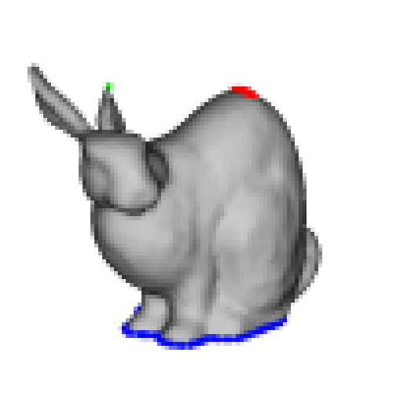

# Task09: Laplacian Mesh Deformation (Quadratic Programming, Sparse Matrix)



**Deadline: July 4th (Thu) at 15:00pm**

----

## Before Doing Assignment

### Install Python (if necessary)
We use Python for this assignment. 
This assigment only supports Python ver. 3.

To check if Python 3.x is installed, launch a command prompt and type `python3 --version` and see the version.

For MacOS and Ubuntu you have Python installed by default. 
For Windows, you may need to install the Python by yourself.
[This document](https://docs.python.org/3/using/windows.html) show how to install Python 3.x on Windows.


### Virtual environment

We want to install dependency ***locally*** for this assignment.

```bash
cd acg-<username> 
python3 -m venv venv  # make a virtual environment named "venv"
```

Then, start the virtual environment.
For Mac or Linux, type

```bash
source venv/bin/activate  # start virtual environment 
```

For Windows, type  

```bash
venv\Scripts\activate.bat  # start virtual environment
```

In the command prompt, you will see `(venv)` at the beginning of each line.
There will be `venv` folder under `acg-<username>`.     

### Install dependency

In this assignment we use many external library. We use `pip` to install these.

```bash
pip3 install numpy
pip3 install moderngl
pip3 install moderngl_window
pip3 install scipy
```

Alternatively, you can install above dependency at once by

```bash
cd acg-<username>/task09
pip3 install -r requirements.txt
```

type `pip3 list` and then confirm you have libraries such as `moderngl`, `numpy`, `pillow`, `pyglet`, `pyrr`, `scipy` etc.

### Make branch

Follow [this document](../doc/submit.md) to submit the assignment, In a nutshell, before doing the assignment,  
- make sure you synchronized the `main ` branch of your local repository  to that of remote repository.
- make sure you created branch `task09` from `main` branch.
- make sure you are currently in the `task09` branch (use `git branch -a` command).

Now you are ready to go!

---

## Problem 1 (Python execution practice)

Run the code with `python3 main.py` 

The program will output `out.png`. Rename it to `out_default.png` then it replaces the image below. 


This code only move the position of fixed vertex. Let's deform other vertices to make hte deformation smooth!


## Problem 2 (smooth deformation with Laplacian)

Write a few lines of code around line #134 to implement smooth mesh deformation using Laplacian. 

The program will output `out.png`. Rename it to `out_laplacian.png` then it replaces the image below.


 

## Problem 3 (even smoother deformation with Bi-Laplacian)

Write a few lines of code around line #134 to implement smooth mesh deformation using BiLaplacian.

The program will output `out.png`. Rename it to `out_bilaplacian.png` then it replaces the image below.


## After Doing the Assignment

After modify the code, push the code and submit a pull request. Make sure your pull request only contains the files you edited. Good luck!

BTW, You can exit the virtual environment by typing `deactivate` in the command prompt.

